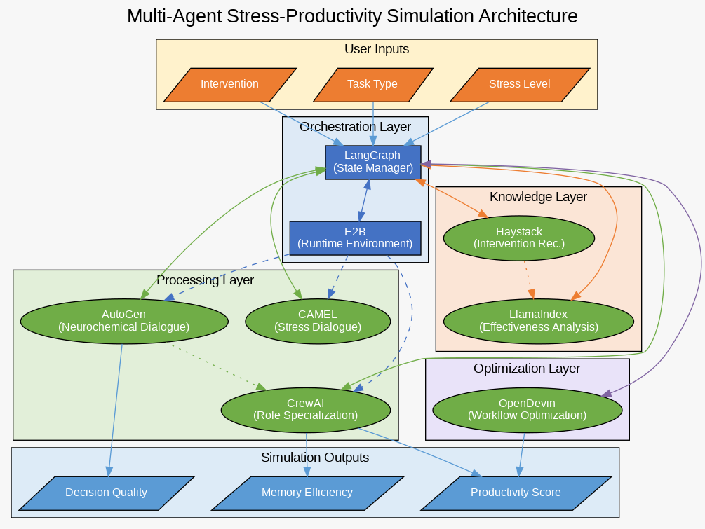
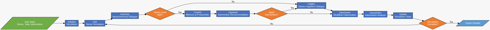
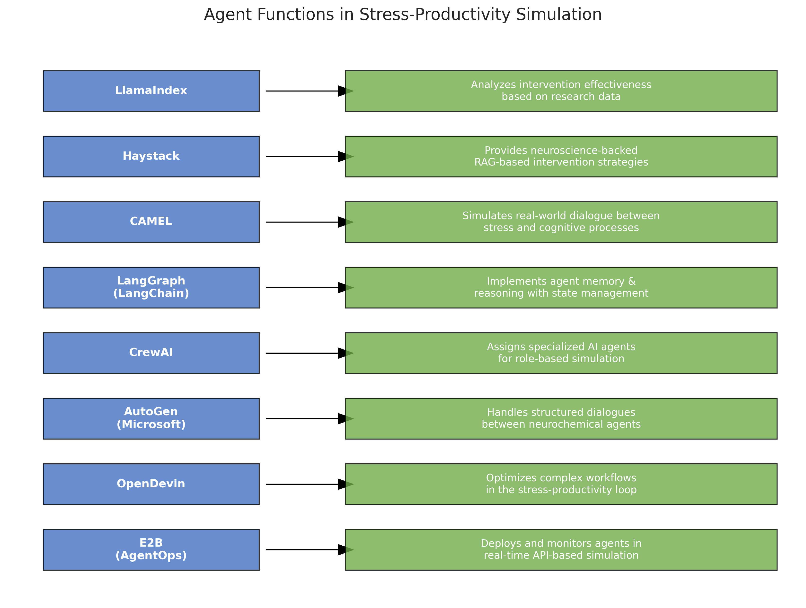
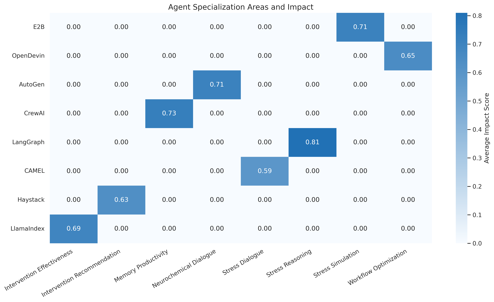
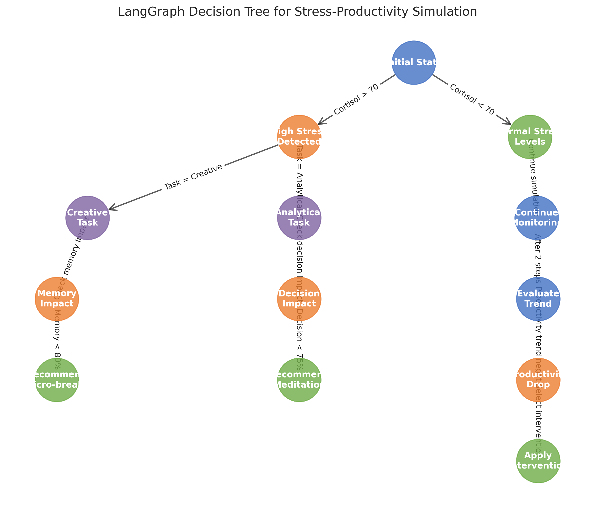
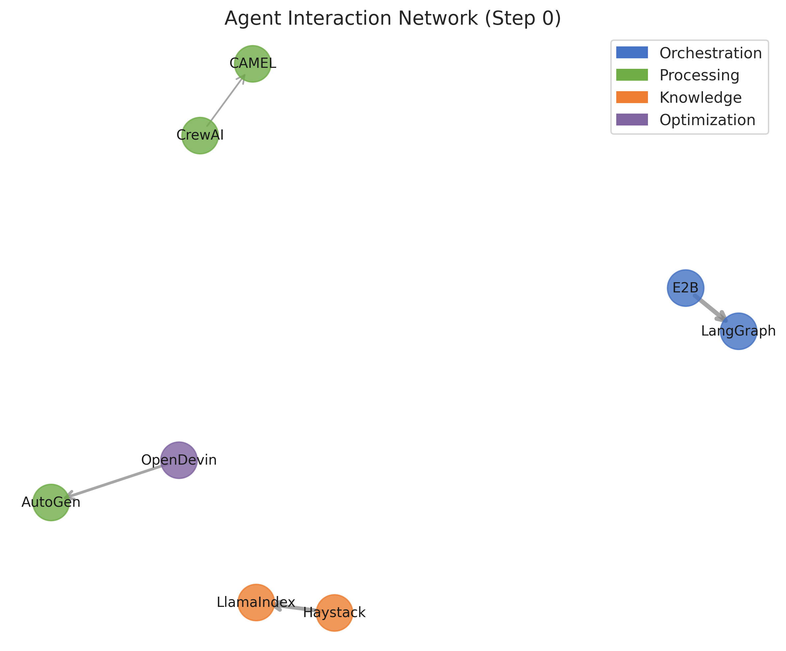
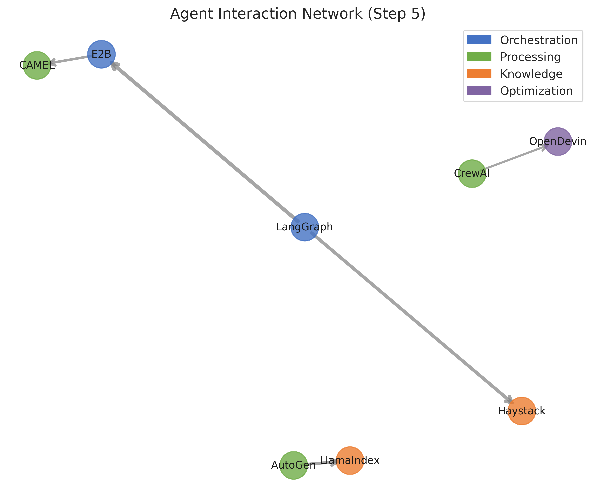
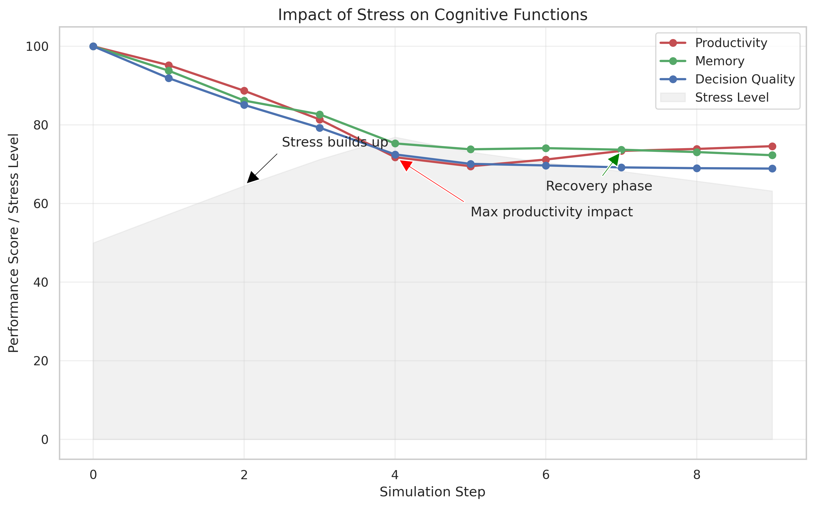
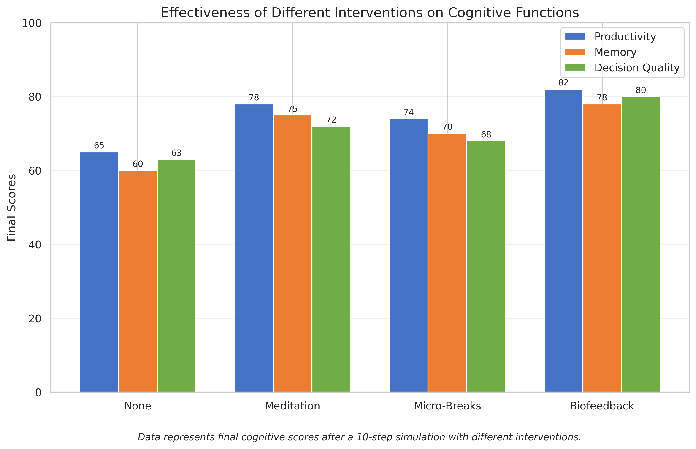

#Please note this repository uses a modified MIT license to account for attribution. License details: 👆

# CortexFlow

<p align="center">
  
</p>

CortexFlow is a multi-agent AI system for modeling cognitive processes, focusing on the complex interactions between stress, neurochemistry, and productivity. Using a layered architecture of specialized agents, it simulates how stress affects memory, decision-making, and overall cognitive performance.

##  Overview

The human brain's response to stress involves complex neurochemical processes that affect our ability to think clearly, solve problems, and work efficiently. CortexFlow simulates these interactions through a sophisticated multi-agent system that models:

- Neurochemical dynamics (cortisol and dopamine fluctuations)
- Cognitive impacts of varying stress levels
- Effectiveness of different intervention strategies
- Patterns in workflow and productivity

By integrating leading AI agent frameworks (LangGraph, AutoGen, CrewAI, etc.), CortexFlow creates a comprehensive simulation of how the mind responds to stress during various task types.

##  Key Features

- **Cognitive Simulation**: Model productivity, memory efficiency, and decision quality under stress
- **Intervention Testing**: Evaluate meditation, micro-breaks, and biofeedback techniques
- **Agent-Based Architecture**: Specialized agents for different cognitive roles
- **Dynamic Interactions**: Observe how agents collaborate as stress levels change
- **Advanced Visualizations**: Track metrics, neurochemicals, and agent interactions
- **Research-Backed**: Insights drawn from neuroscience and productivity research

##  System Architecture

CortexFlow employs a four-layer architecture with specialized agents in each layer:

<p align="center">
  
</p>

1. **Orchestration Layer**
   - LangGraph Agent: Central state manager and reasoning engine
   - E2B Agent: Runtime environment for deploying and monitoring simulations

2. **Processing Layer**
   - AutoGen Agent: Models neurochemical dialogues between brain regions
   - CAMEL Agent: Simulates stress dialogue patterns and internal self-talk
   - CrewAI Agent: Handles role specialization for cognitive processes

3. **Knowledge Layer**
   - Haystack Agent: Recommends stress interventions based on current state
   - LlamaIndex Agent: Analyzes intervention effectiveness using research data

4. **Optimization Layer**
   - OpenDevin Agent: Detects workflow patterns and suggests optimizations

##  Agent Roles & Capabilities

Each agent in CortexFlow specializes in specific cognitive functions:

<p align="center">
  
</p>

Agent performance varies across different domains:

<p align="center">
  
</p>

##  Decision Logic

The system uses a sophisticated decision tree to determine when and how to apply interventions:

<p align="center">
  
</p>

##  Agent Interactions

CortexFlow models the dynamic interaction between agents, which evolves as the simulation progresses:

<p align="center">
  
  
</p>

##  Key Insights

The system reveals how stress affects cognitive performance and which interventions are most effective:

<p align="center">
  
</p>

<p align="center">
  
</p>

##  Installation

### Basic Installation

```bash
pip install cortexflow
```

### With Specific Agent Frameworks

```bash
# Install with specific agent framework
pip install "cortexflow[autogen]"  # Include AutoGen support
pip install "cortexflow[langgraph]"  # Include LangGraph support

# Install with specific capability groups
pip install "cortexflow[knowledge]"  # Haystack and LlamaIndex
pip install "cortexflow[processing]"  # AutoGen, CAMEL, and CrewAI

# Install everything
pip install "cortexflow[all]"

# Install development tools
pip install "cortexflow[dev]"
```

## 💻 Usage

### Command Line Interface

```bash
# Run a basic simulation
cortexflow run --stress moderate --task creative --intervention none --steps 10

# Run a simulation with meditation intervention
cortexflow run --stress severe --task analytical --intervention meditation --steps 15

# Compare different interventions
cortexflow compare-interventions --task creative --stress moderate

# Visualize results
cortexflow visualize simulation_results.json --format html

# List available agents
cortexflow agents

# Run a predefined scenario
cortexflow run-preset creative_stress
```

### Python API

```python
import asyncio
from cortexflow.core.simulation import Simulation
from cortexflow.core.types import StressLevel, TaskType, InterventionType
from cortexflow.agents import E2BAgent, LangGraphAgent, AutoGenAgent

async def run_simulation():
    # Initialize agents
    agents = {
        "e2b": E2BAgent(),
        "langgraph": LangGraphAgent(),
        "autogen": AutoGenAgent()
    }
    
    # Create and configure simulation
    simulation = Simulation(agents=agents)
    simulation.configure(
        stress_level=StressLevel.MODERATE,
        task_type=TaskType.CREATIVE,
        intervention=InterventionType.MEDITATION,
        steps=10
    )
    
    # Run simulation
    results = await simulation.run_simulation()
    
    # Export results
    output_path = simulation.export_results("meditation_results.json")
    print(f"Results saved to {output_path}")

# Run in async context
asyncio.run(run_simulation())
```

### Visualization API

```python
from cortexflow.visualization import plot_metrics_over_time, create_agent_network
from cortexflow.core.utils import load_results

# Load simulation results
results = load_results("simulation_results.json")

# Create visualizations
plot_metrics_over_time(results["history"], output_file="metrics.png")
create_agent_network(results["agent_interactions"], results["agent_types"], 
                     output_file="agent_network.png")
```

##  Contributing

Contributions are welcome! Here's how to get started:

1. **Clone the repository**
   ```bash
   git clone https://github.com/ShaliniAnandaPhD/CortexFlow.git
   cd CortexFlow
   ```

2. **Set up development environment**
   ```bash
   pip install -e ".[dev]"
   ```

3. **Run tests**
   ```bash
   pytest
   ```

4. **Create a branch and submit a PR**
   ```bash
   git checkout -b feature/your-feature-name
   # Make your changes
   git commit -m "Add your feature"
   git push origin feature/your-feature-name
   ```

See [CONTRIBUTING.md](CONTRIBUTING.md) for detailed guidelines.

##  License

This project is licensed under the MIT License - see the [LICENSE](LICENSE) file for details.

##  Acknowledgments

CortexFlow builds upon several open-source agent frameworks:

- [LangGraph](https://github.com/langchain-ai/langgraph) - State management and agent orchestration
- [AutoGen](https://github.com/microsoft/autogen) - Neurochemical dialogue simulation
- [CrewAI](https://github.com/crewai/crewai) - Role specialization for cognitive processes
- [CAMEL](https://github.com/camel-ai/camel) - Stress dialogue modeling
- [Haystack](https://github.com/deepset-ai/haystack) - Intervention recommendation
- [LlamaIndex](https://github.com/jerryjliu/llama_index) - Research retrieval and analysis
- [E2B](https://github.com/e2b-dev/e2b) - Agent runtime environment
- [OpenDevin](https://github.com/OpenDevin/OpenDevin) - Workflow optimization

##  Citation

If you use CortexFlow in your research, please cite:

```
@software{CortexFlow2025,
  author = {Ananda, Shalini and Team, CortexFlow},
  title = {CortexFlow: Multi-Agent AI System for Modeling Cognitive Processes},
  year = {2025},
  url = {https://github.com/ShaliniAnandaPhD/CortexFlow}
}
```

##  Contact

For questions or feedback, please open an issue on GitHub or contact the project maintainers.
